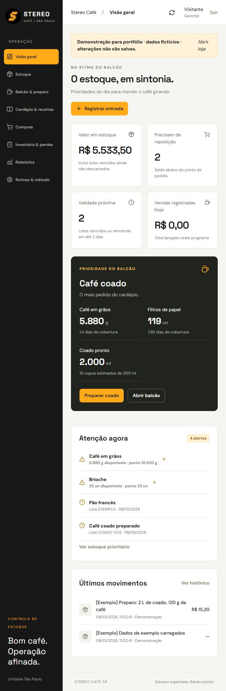

# Stereo Café — estoque e operação

Sistema web desenvolvido para apoiar a operação de uma cafeteria em São Paulo. O cardápio fornecido possui 54 produtos e variações, e o café coado é o item de maior saída informado pelo solicitante.



## Funcionalidades implementadas

- Estoque por insumo e lote, validade, armazenamento e custo unitário.
- PVPS: primeiro que vence, primeiro que sai. Lotes vencidos e bateladas fora do limite de uso ficam indisponíveis.
- Fichas técnicas confirmadas pelo gerente, baixas por venda e substituição do leite integral por vegetal com o adicional do cardápio.
- Preparo do coado: grãos e filtros são consumidos na batelada; o café preparado é consumido na venda.
- Reposição por consumo previsto, prazo de entrega e reserva; compras pendentes descontadas da sugestão.
- Recebimento integral de pedidos, perdas justificadas e contagem por lote.
- Acesso individual com perfis de gerente e atendente, validação no servidor e autoria nos movimentos.
- Estorno de venda com devolução aos lotes de origem e histórico preservado.
- Concorrência otimista, transação de saldo + auditoria e identificador de operação para impedir lançamentos duplicados em reenvios.
- Histórico paginado, totais do dia independentes da paginação, exportações e recuperação de backup.
- Demonstração com dados fictícios em `/demo`, sem gravar alterações nos dados da loja.

## Stack

React 19, TypeScript, CSS, Lucide, Vinext/Vite, Cloudflare Workers, D1 (SQLite), Drizzle e Zod. Testes de domínio e permissões usam `node:test`; há também um roteiro de integração HTTP local. GitHub Actions executa testes, verificação de tipos, formatação e build.

O projeto usa a compatibilidade de App Router do Vinext, com versão fixada no lockfile. O framework está em beta: atualizações precisam passar pelos testes e pela validação local antes de chegar à loja.

## Executar localmente

Requisitos: Node.js **24** e npm. Windows, macOS e Linux são suportados pelo fluxo local.

```sh
npm ci --include=dev --include=optional
```

Copie `.dev.vars.example` para `.dev.vars`. O exemplo contém apenas a identidade fictícia `seedy@sites.test`, usada pelo login de desenvolvimento em loopback.

```sh
npm run build
npm run db:local
npm run dev
```

Abra o endereço informado pelo servidor, normalmente `http://127.0.0.1:5173/`. Use o link **Entrar com sua conta** para o login fictício local. A demonstração de portfólio está em `http://127.0.0.1:5173/demo` e não requer cadastro de estoque.

`npm run db:local` aplica cada migração uma vez e registra sua aplicação no banco **local**. Não aplique migrações já registradas manualmente sobre o mesmo banco sem reconciliar seu histórico.

## Verificar

```sh
npm test
npm run typecheck
npm run format:check
npm run build
```

Com o servidor local ativo e um banco de teste vazio:

```sh
node tests/api.integration.mjs
```

Esse teste grava exclusivamente em loopback e verifica autenticação, duas vendas concorrentes, reenvio idempotente, entrada inválida, origem externa, estorno e exportação/restauração. Use um banco local descartável; ele não deve conter dados da loja.

## Operação da loja

Leia o [manual operacional](docs/OPERACAO.md) e o [guia de implantação](docs/IMPLANTACAO.md). A disponibilidade de código e testes não substitui a conferência inicial de estoque, custos e receitas pela equipe.

Os preços vieram das imagens do cardápio e precisam de confirmação de vigência. Porções, consumo diário, custos e metas iniciais são sugestões. Nenhuma quantidade inicial é apresentada como estoque real da cafeteria.

## Arquitetura e limites

As regras de negócio ficam em `lib/operations.ts` e a validação em `lib/validation.ts`. O saldo operacional é um snapshot versionado no D1; o histórico fica na tabela `ledger`, separada do snapshot. Isso evita regravar todo o histórico a cada venda. A revisão funciona como compare-and-swap; D1 `batch()` mantém a alteração de saldo, a auditoria e a chave de idempotência na mesma transação.

É uma aplicação para **uma loja**. As gravações concorrentes podem retornar `409`; a interface atualiza os dados e pede conferência antes de repetir. Não há teste de carga de produção nem promessa de capacidade/SLA.

- Vendas manuais, sem integração com PDV, emissão fiscal, pagamentos ou contabilidade.
- Recebimento de pedido integral; entregas parciais devem ser planejadas em pedidos separados.
- Cadastro de funcionário define o papel interno. O proprietário ainda precisa liberar o mesmo e-mail no acesso privado da hospedagem.
- Os backups de saldos não substituem uma política de cópia externa e exportação do banco completo.
- O limite de uso do coado é operacional e editável; não certifica segurança sanitária.

## Segurança e dados de portfólio

O código público contém modelos e demonstrações. Não publique bancos `.wrangler`, arquivos `.dev.vars`, backups, exports da loja ou contatos dos funcionários. O pacote do GitHub não contém a identidade privada do Site nem credenciais de hospedagem.

A autenticação de produção depende do gateway confiável do Sites. **Não exponha o Worker diretamente na internet aceitando os cabeçalhos de identidade enviados pelo cliente.** A simulação de login local não é autenticação de produção. Veja [SECURITY.md](SECURITY.md).

O repositório inclui dados fictícios na demonstração. A marca e o cardápio foram fornecidos como referência para este projeto; os direitos dos materiais de marca pertencem aos seus titulares.

## Referências

- [Sebrae: curva ABC](https://meuatendimento.sebrae.com.br/sites/PortalSebrae/artigos/voce-conhece-a-curva-abc-para-controle-de-estoque%2C5524ef559dc9e710VgnVCM100000d701210aRCRD).
- [São Paulo: boas práticas de alimentos](https://legislacao.prefeitura.sp.gov.br/portaria-secretaria-municipal-da-saude-2619-de-6-dezembro-de-2011).
- [Anvisa: cartilha de boas práticas](https://www.gov.br/anvisa/pt-br/centraisdeconteudo/publicacoes/alimentos/manuais-guias-e-orientacoes/cartilha-boas-praticas-para-servicos-de-alimentacao.pdf).
- [Cloudflare D1: transações com batch](https://developers.cloudflare.com/d1/worker-api/d1-database/#batch).

Desenvolvimento de João Medeiros com assistência de IA. O estudo de caso descreve funcionalidades verificadas, sem atribuir ganhos financeiros ou adoção operacional ainda não comprovados.
